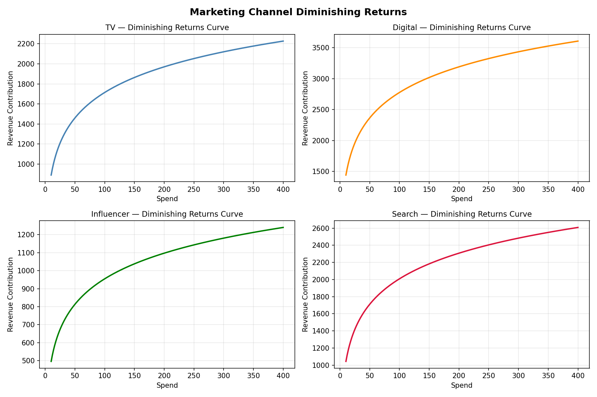
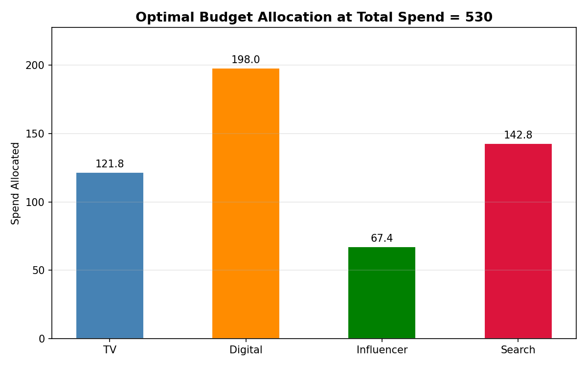
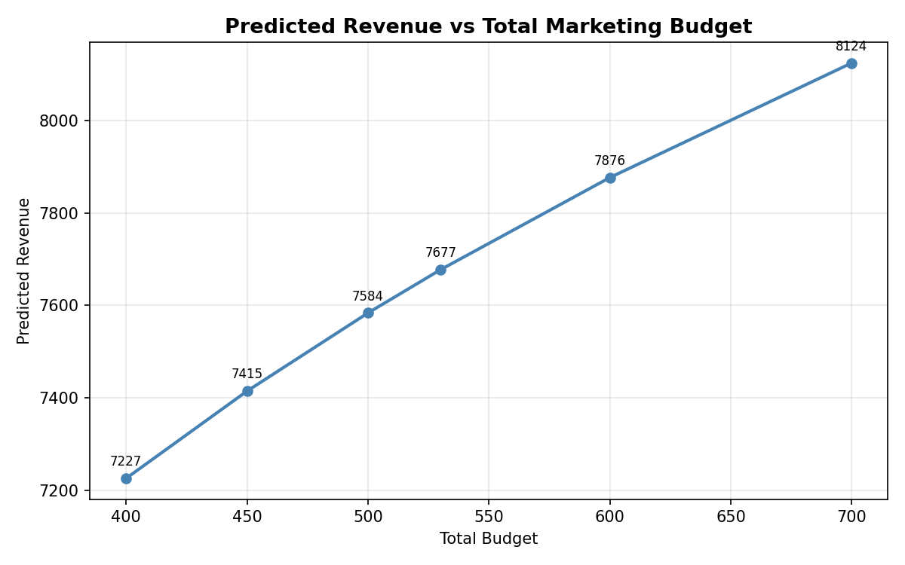
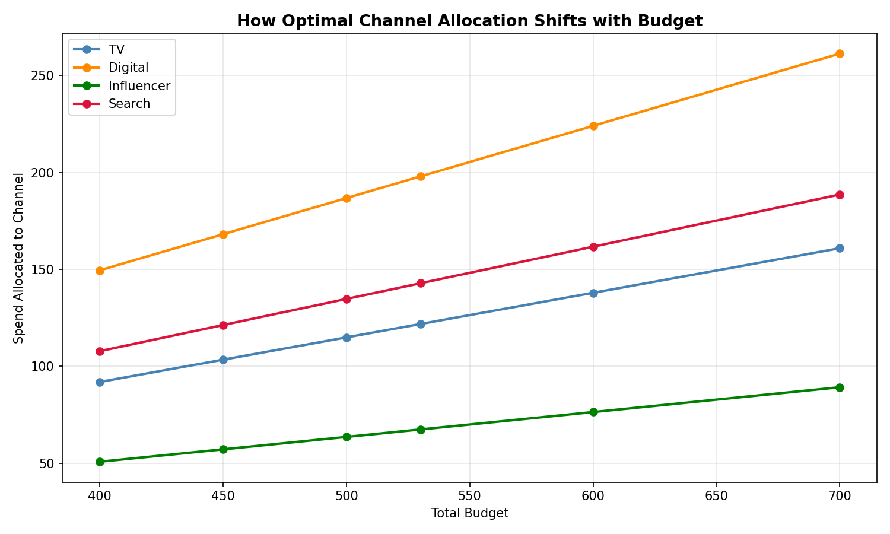

# Marketing Spend Optimization Engine

A decision analytics engine that optimizes multi-channel marketing budget allocation using regression modeling and constrained optimization.

---

## Business Problem

A marketing team has a fixed budget to allocate across 4 channels — TV, Digital, Influencer, and Search. Blindly splitting the budget equally ignores the fact that each channel has a different ROI and exhibits diminishing returns. This engine determines the allocation that maximizes predicted revenue.

---

## Key Results

At a total budget of 530 units, the optimal allocation is:

| Channel    | Optimal Spend |
|------------|--------------|
| TV         | 121.80       |
| Digital    | 197.97       |
| Influencer | 67.40        |
| Search     | 142.83       |

**Predicted Maximum Revenue: 8008.66**

Digital receives the highest allocation due to its superior marginal ROI at current spend levels.

---

## Methodology

1. Simulated 120 weeks of realistic marketing spend data with log-based revenue generation
2. Built Multiple Linear Regression model with log-transformed features to capture diminishing returns
3. Validated model assumptions using R², VIF scores, and residual diagnostics
4. Solved constrained optimization problem using SciPy across 6 budget levels
5. Ran scenario simulations to stress-test allocation decisions

---

## Sample Output Charts

### Diminishing Returns Curves


### Optimal Allocation at Budget = 530


### Revenue vs Total Budget


### Channel Allocation Shift by Budget


---

## Tech Stack

- Python
- pandas, numpy
- statsmodels
- scipy
- matplotlib

---

## How to Run
```bash
# Create and activate virtual environment
python -m venv venv
venv\Scripts\activate

# Install dependencies
pip install -r requirements.txt

# Run in order
python src/data_generator.py
python src/regression_model.py
python src/optimization.py
python src/simulation.py
python src/visualize.py
```

Or open `analysis.ipynb` for the full end-to-end walkthrough with outputs.
```

Then commit and push:
```
git add README.md
git commit -m "Rewrite README with results, charts and methodology"
git push